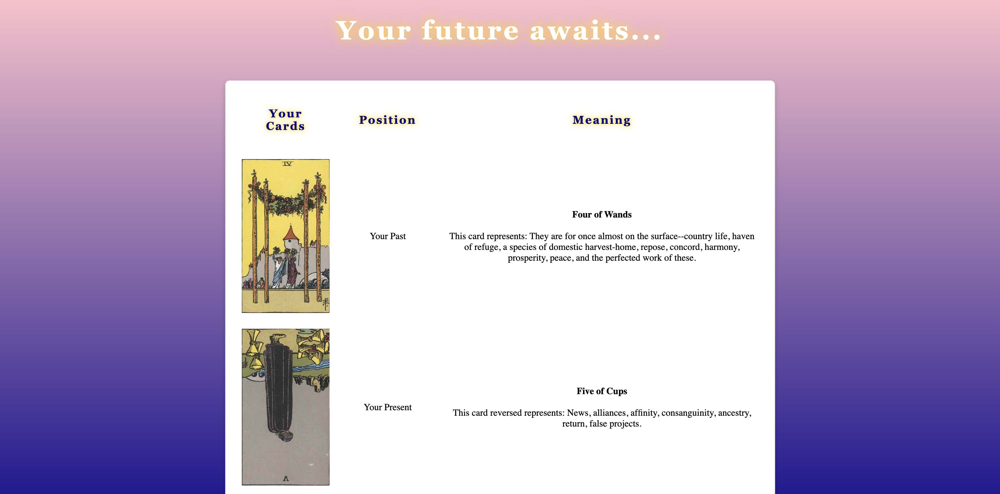

# Welcome to Augur, the free Tarot tool! 🔮
✨The cards foretold your arrival...✨

Augur is a Java-based command line interface that allows users to divine their future by performing authentic Tarot readings. To make this possible, it calls the [Tarot Card API](https://tarotapi.dev/) and implements the [Picocli framework](https://picocli.info/). All Tarot card images used in this project are taken from this [public domain archive](https://www.sacred-texts.com/tarot/xr/index.htm).

## What is Tarot?
Tarot is an ancient divination practice using a deck of 78 cards, each with symbolic imagery and meanings. A Tarot reading involves drawing cards in specific patterns (spreads) to gain insight into questions about the past, present, and future.

## Features:
**Multiple Tarot Spreads**: Choose between three traditional Tarot spreads:
   - **One-card draw**: Quick insight for simple questions
   - **Three-card draw**: Past, present, and future perspective  
   - **Ten-card Celtic Cross**: Comprehensive reading for complex situations

**Guided Selection**: Users unfamiliar with Tarot can let Augur choose the most suitable spread. Augur asks thoughtful questions about your needs and interests to recommend the perfect Tarot spread to divine your future.

**Authentic Experience**: Each spread includes:
   - Images of each Tarot card taken from the 1909 Rider Waite Tarot Deck.
   - The significance of the card's position in the spread
   - Detailed divinatory meanings

**Reversed Cards**: As in real Tarot readings, some cards appear in reverse position with altered meanings. Each card has a 30% chance of being drawn reversed, adding authentic randomness to each reading.

**Multiple Readings**: Request as many readings as needed to explore different aspects of your future!

## Example Reading:


## Quick Start:
### Prerequisites:
- Java 11 or higher
- Git (for cloning the repository)

### Installation & Usage:
1. **Clone the repository:**
   ```bash
   git clone https://github.com/fionadark/augur
   ```

2. **Navigate to the project directory:**
   ```bash
   cd augur
   ```

3. **Run Augur:**
   ```bash
   ./gradlew clean build run
   ```

4. **Follow the interactive prompts** to receive your Tarot reading!

## Technologies Used:
- **Java** - Core programming language
- **Gradle** - Build automation and dependency management
- **Picocli** - Command-line interface framework
- **Jackson** - JSON processing for API responses
- **JUnit 5** - Unit testing framework
- **Mockito** - Mocking framework for tests

## API Reference:
This project uses the [Tarot Card API](https://tarotapi.dev/) to fetch authentic Tarot card data and meanings.

## Contributing:
Contributions are welcome! Please feel free to submit a Pull Request.

## License:
Code available under the Apache 2.0 license.